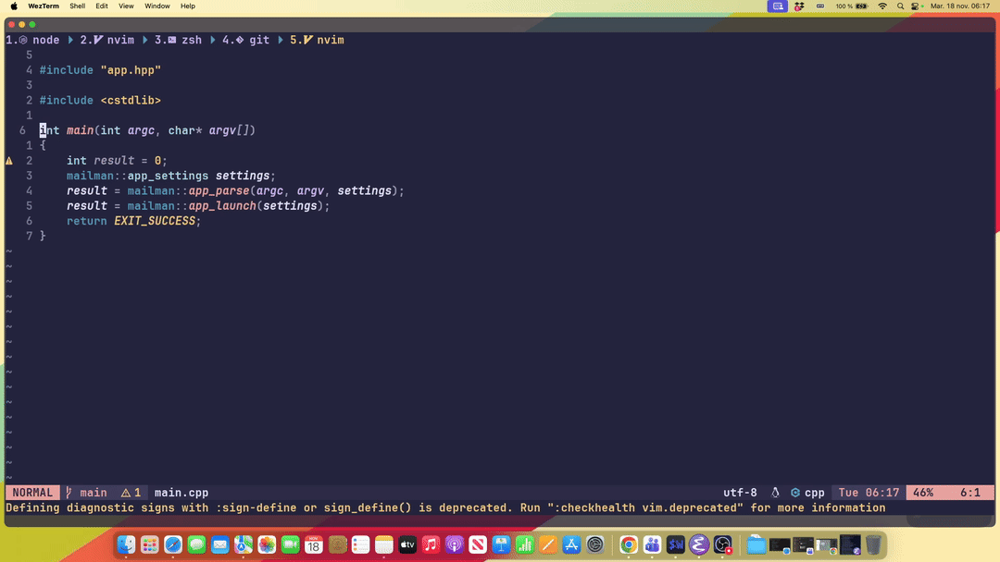

# Vim/Neovim Plugin for Presets/Workflow CMake Projects
*Written by Eric Nantel*



## From the author
I wrote this plugin (first one) using Vimscript so that I could run cmake commands within Vim/Neovim ecosystem.
I have not found another plugin that supported the 'New' way of creating cmake projects with presets and workflows.
So I make this. I am hoping you will find this useful in your workflow for building apps and frameworks with cmake.
One important aspect I wanted to focus on, was to be as less intruisive as possible, and that we can integrate it fast.

## Prerequisites

* cmake installed
* Projects must include both CMakePresets.json and CMakeFiles.txt files

## Installation

In Vim using vim-plug, place this repository within vim-plug begin/end calls:
```vim
call plug#begin('~/.vim/plugged')
   Plug 'ericnantel/vim-cmake'
call plug#end()
```

In Neovim using lazy.nvim, place this repository along with other plugins:
```lua
require("lazy").setup({
  spec = {
    {
      "ericnantel/vim-cmake",
    },
  },
})
```

## Features

* Supports CMake presets
* Supports CTest & GoogleTest presets
* Supports CMake Workflow presets
* Supports [Bear](https://github.com/rizsotto/Bear) if available
* (Coming soon) Supports Ease integration with LSP and DAP
* (Coming soon) Supports Switching presets or workflow presets
* (Coming soon) Supports Command Log Window customization

## Useful links

* [YouTube Tutorial](https://youtu.be/THgvJIJIHV4)
* [CMake Examples](https://github.com/ericnantel/cmake_examples)

## Known issues


## Commands and Global Variables
Available Commands:
* CMakeListPresets()
* CMakeListPresetVariables(preset)
* CMakePreset(preset)
* CMakeFreshPreset(preset)
* CMakeBuildPreset(preset)
* CMakeTestPreset(preset)
* CMakeWorkflowListPresets()
* CMakeWorkflowPreset(preset)
* CMakeWorkflowFreshPreset(preset)
* CMakeCloseCommandLogWindow()

For example, in Vim:
```vim
nnoremap <F5> <cmd>CMakeListPresets<CR>
nnoremap <F6> <cmd>CMakeFreshPreset default<CR>
nnoremap <F7> <cmd>CMakeBuildPreset default<CR>
nnoremap <F8> <cmd>CMakeWorkflowFreshPreset default<CR>
```
For example, in Neovim:
```lua
vim.keymap.set("n", "<F5>", "<cmd>CMakeListPresets<CR>", { desc = "CMake List Presets" })
vim.keymap.set("n", "<F6>", "<cmd>CMakeFreshPreset default<CR>", { desc = "CMake Fresh Preset 'default'" })
vim.keymap.set("n", "<F7>", "<cmd>CMakeBuildPreset default<CR>", { desc = "CMake Build Preset 'default'" })
vim.keymap.set("n", "<F8>", "<cmd>CMakeWorkflowFreshPreset default<CR>", { desc = "CMake Workflow Fresh Preset 'default'" })
```

Available Global Variables:
* g:cmake_bear_intercept (disabled by default)

For example, in Vim you can enable bear intercept (if installed):
```vim
let g:cmake_bear_intercept = 1
```


## Thank you
You made it this far ! Thank you !


We stronly encourage you to give this repository a GitHub :star: to boost organic growth. 
